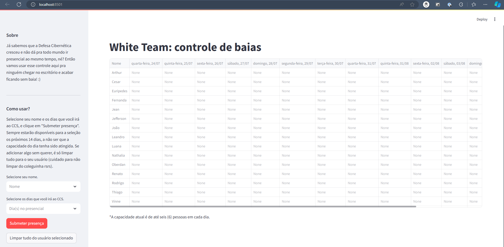

# Aplicativo de Controle de Baias

Este é um aplicativo de controle de baias construído usando Streamlit. Ele permite o gerenciamento e monitoramento eficiente das baias do White Team da Defesa Cibernética do Sicoob.

## Preview



Você pode ver uma prévia do aplicativo na imagem acima.

## Requisitos

Os requisitos para rodar este aplicativo estão listados no arquivo `requirements.txt`. Para instalar as dependências, use o seguinte comando:

```bash
pip install -r requirements.txt
```

## Executando o Aplicativo

Para rodar o aplicativo, execute o seguinte comando:

```
streamlit run .\WhiteTeam.py
```

Após a execução, você verá a seguinte mensagem:

```
You can now view your Streamlit app in your browser.

Local URL: http://localhost:8501
Network URL: http://192.168.1.108:8501
```

## Contribuindo

Contribuições são bem-vindas! Sinta-se à vontade para abrir issues e enviar pull requests.